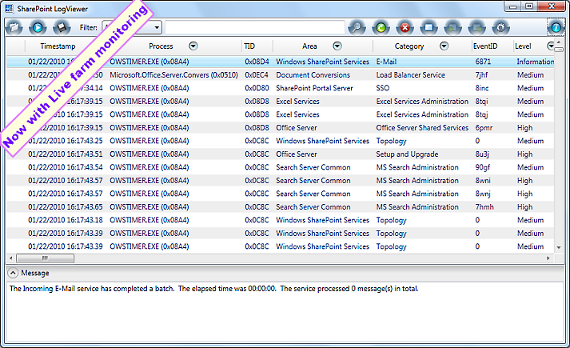

Welcome to the home of SharePoint Log Viewer. The most advanced and easy to use viewer of MOSS/WSS ULS logs.

SharePoing Log Viewer is a Windows application for reading and filtering Microsoft SharePoint ULS Logs. 

**Key Features:**

* View multiple SharePoint log files at once
* Search by any field
* Filter the log by any field
* File drag & drop support
* Live monitoring for +entire farm+
* Export filtered log entries
* Bookmark log entries
* Get popup notification of SharePoint log events from system tray
* Receive email notifications on errors
* Redirect log entries to event log
* Supports SharePoint 2007, 2010 and 2013

**System Requirements:**

* .NET Framework 3.5
* Windows XP or above

Developed by Overroot Inc. ([http://www.overroot.com](http://www.overroot.com))